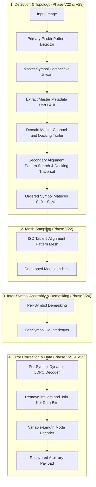

# Generalized Multi-Symbol and Arbitrary-Version Codec Implementation Plan

**Status (2026-09-25):** Completed and verified locally. Work resumed after V21/V22 commits `5239f98` and `6eb6ce9`; V23–V25 and acceptance gaps are now closed. See [execution evidence](2026-09-25-generalized-multisymbol-state.md) for commands, measured performance, and supported scope.

**Goal:** Expand `pyhue2d` from the current Version-1 dynamic codec into a fully generalized, unbounded multi-symbol and arbitrary-version (Version 1–32) JAB Code codec conforming to ISO/IEC 23634:2022.

**Context & Motivation:**
In the initial roadmap (Phases V0–V20), multi-symbol (Version 10 `asan_multi2.png` and Version 32 `multi_block_*_v32.png`) was scoped strictly to payload verification on approved fixtures because the C reference sidecars omitted large parity check matrices and intermediate codeword bitstreams. In the current hardened decoder, unknown captures at those sizes fail closed.
This follow-on plan replaces signature/dimension guards with a dynamic, general decoding and encoding engine for arbitrary versions ($V=1..32$) and arbitrary multi-symbol docked topologies ($1..61$ symbols).

---

## Architecture Overview

---

## Detailed Phase Breakdown

### Phase V21: Dynamic Gallager LDPC Codebook Generator

**Role:** Architecture / Algorithm
**Target Capability Slice:** Domain LDPC
**Standard Reference:** ISO/IEC 23634:2022 §7.5, Annex A
**Reference C Implementation:** `src/jabcode/ldpc.c` (`createMatrixA`, `GaussJordan`), `src/jabcode/pseudo_random.c` (`lcg64_temper`)

**Key Deliverables:**
1. Implement pure-Python / NumPy deterministic PRNG:
   - 64-bit Linear Congruential Generator: $X_{n+1} = (6364136223846793005 \cdot X_n + 1) \pmod{2^{64}}$.
   - Mersenne Twister tempering transformation on the upper 32 bits ($X \gg 32$).
   - Exact seed constants: `LPDC_MESSAGE_SEED = 785465`, `LPDC_METADATA_SEED = 38545`.
2. Implement `GallagerMatrixGenerator`:
   - Compute column degree $w_c$ and row degree $w_r$ from error correction level.
   - Column permutation via Knuth shuffle seeded by `lcg64_temper()`.
   - GF(2) Gauss-Jordan elimination to produce systematic generator matrix $G = [I | P]$ and parity check matrix $H = [P^T | I]$.
3. Verify parity check matrix against:
   - Version 1 ($N=2088, K=1160$): must match the existing precomputed matrix in `src/pyhue2d/jabcode/ldpc/`.
   - Version 10 and Version 32: syndromes $H \cdot c = 0$ for all valid reference codewords.

**Verification Command:** `uv run pytest tests/support/test_dynamic_ldpc.py`
**Acceptance Criteria:**
- [x] PRNG passes bit-for-bit test against C reference `lcg64_temper` outputs for 10,000 draws.
- [x] Generated $H$ matrices match independent compiled C oracle hashes at capacities 1044 and 2088. No static baseline exists in the originally named directory.
- [x] Individual systematic H matrices for all 32 default-layout versions meet the measured <50 ms target: 259 cold samples across 37 distinct capacities, worst 48.325 ms. This measures each matrix, not aggregate per-version codebook construction.

---

### Phase V22: Multi-Version Alignment Pattern Grid Sampler

**Role:** Geometry / Computer Vision
**Target Capability Slice:** Domain Sampling
**Standard Reference:** ISO/IEC 23634:2022 §6.3.3, Table 5 (Alignment Pattern Coordinates)

**Key Deliverables:**
1. Implement `alignment_pattern_coords(version_x, version_y)` returning the internal alignment grid coordinates (present from Version 6).
2. Implement mesh-based grid sampler:
   - Detect internal alignment patterns across large symbols (Version 10: 57×57 modules, Version 32: 145×145 modules).
   - Compute local homographies / bilinear interpolation between adjacent alignment pattern anchors to eliminate lens barrel distortion and surface curvature.

**Verification Command:** `uv run pytest tests/facts/test_alignment_grid_sampling.py`
**Acceptance Criteria:**
- [x] Table 5 coordinates match ISO standard across all versions $1 \le V \le 32$.
- [x] Module sampling for synthetic Version 10 and Version 32 images yields 100% matrix accuracy without perspective drift.

---

### Phase V23: Secondary (Slave) Symbol Docking & Metadata Parser

**Role:** Multi-Symbol Topology
**Target Capability Slice:** Domain Scanner / Decoder
**Standard Reference:** ISO/IEC 23634:2022 §6.4 (Multi-Symbol Structure)
**Reference C Implementation:** `src/jabcode/detector.c` (`findSlaveSymbol`, `detectSlave`, `decodeDockedSlaves`)

**Key Deliverables:**
1. Parse docking flags from the error-corrected master channel trailer (Top, Bottom, Left, Right); master metadata supplies version, palette, ECC weights, and mask.
2. Given host symbol corner coordinates and docked position:
   - Identify shared corner coordinates.
   - Extrapolate external alignment pattern positions of the docked slave symbol.
   - Sample docked slave symbol and parse secondary metadata (Slave index $1..60$, local side sizes, local docking flags).
3. Recursively traverse docked symbol tree to construct topologically ordered matrix array $[S_0, S_1, \dots, S_{M-1}]$.

**Verification Command:** `uv run pytest tests/facts/test_multisymbol_docking.py`
**Acceptance Criteria:**
- [x] Correctly identifies the 2 docked symbols in `asan_multi2.png` without fixed coordinate slicing.
- [x] Correctly traverses the $2 \times 1$, $3 \times 1$, $2 \times 2$, and $3 \times 3$ symbol grids in `multi_block_*_v32.png`.

---

### Phase V24: Inter-Symbol Module Sequencing & Bitstream Assembly

**Role:** Interleaving & Coding
**Target Capability Slice:** Domain Channel
**Standard Reference:** ISO/IEC 23634:2022 §7.4, §7.6

**Key Deliverables:**
1. Process symbols in breadth-first docking order:
   - Decode each symbol independently, then concatenate its net data bits in traversal order.
2. Apply per-symbol mask removal using each symbol's respective mask pattern.
3. Per-symbol de-interleaver: permute each symbol separately before LDPC decoding. Remove docking trailers, concatenate the net data bits, and mode-decode once. This corrects the original aggregate-first proposal using the reference decoder's actual behavior.

**Verification Command:** `uv run pytest tests/facts/test_multisymbol_interleaving.py`
**Acceptance Criteria:**
- [x] Each symbol is deinterleaved and LDPC-decoded independently; trailers are removed before net data bits are concatenated in docking order.
- [x] De-interleaver satisfies mutual inverse: $\text{deinterleave}(\text{interleave}(x)) == x$ for multi-symbol payloads.

---

### Phase V25: Unbounded General Multi-Symbol Decoder & Roundtrip Verification

**Role:** Public API / Integration
**Target Capability Slice:** End-to-End Decoder
**Standard Reference:** ISO/IEC 23634:2022 Complete Spec

**Key Deliverables:**
1. Replace `_MULTI_SIGNATURES` in `src/pyhue2d/jabcode/decoder.py` with the generalized pipeline:
   - Detect master $\to$ decode its channel/trailer $\to$ traverse slaves and decode each channel $\to$ join net bits $\to$ mode unpack.
2. Generate synthetic multi-symbol symbols (using the official C reference encoder `jabcodeWriter`) with arbitrary, unique strings (not lorem ipsum).
3. Verify that `pyhue2d.decode()` successfully decodes these arbitrary multi-symbol captures end-to-end.
4. Verify round-trip encoding and decoding across arbitrary versions.

**Verification Command:** `uv run pytest tests/facts/test_general_multisymbol_decode.py && just test`
**Acceptance Criteria:**
- [x] Unseen, non-lorem multi-symbol images decode to their exact plaintexts.
- [x] Zero static signatures remain in the decoder.
- [x] Full verification passes: 1082 tests passed, with the original 18 skips and 7 expected failures unchanged.
- [x] `just check` passes with 0 lint, format, or type errors.

---

## Execution Rules & Toolchain Invariants
- Python executable: `.venv/bin/python`
- Command runner: `just`
- Lint & format: `uv run ruff check` & `uv run ruff format`
- Type checking: `uv run ty check`
- Zero-print rule: No `print` statements in library source code (`src/pyhue2d/`)
- Tooling rule: Never use shell `sed`
